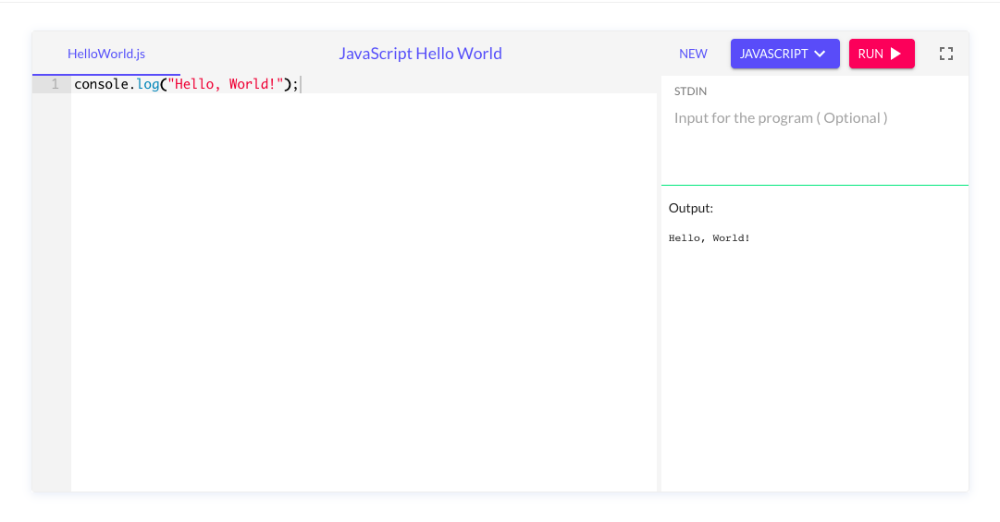
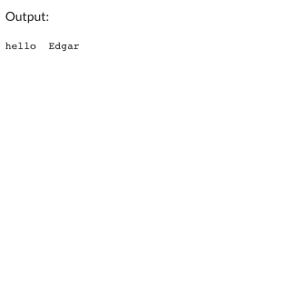

Hallo, heute Ich wird javascript einfach machen. Möglicherweise Sie sind neue zu Javascript, aber bitte, nicht Angst.

## Was ist Javascript?
Heutzutage, Wir alles benutzen der Internet. Im Internet, alles im web sites und apps, haben  Javascript. Zum beispeil, Facebook, Twitter, Youtube, alles haben Javascript.

Sie können Javascript benutzen wenn Sie wöllen dynamischen websites und apps bauen.

Kurz gesagt, Javascript ist the Web Programmiersprache. Sie können Javascript benutzen wenn Sie wöllen seine wunsch-app bauen. Man kann web oder handy apps mit Javascript bauen and das ist sehr einfach.


## Wie kann man mit Javascript anfang?

Wir können Javascript programmeren mit jemand web browser. Bitte, klic auf this url: [Bitte](https://onecompiler.com/javascript)




Hier, Man Kann mit Javascript programmieren. Klik `run` und Sehen Sie der output Region.

Am das `text editor`, Fernen Sie der text ent und copy Kopier das:

```
let name = 'Tragen Sie hier Ihren Namen ein'

console.log('hello ', name )
```

Aber bitte, zwischen die '', Tragen Sie Ihren Namen ein.

Danach, klik auf der `run button`.

## Was haben wir gemacht?

Sie wird etwas wie das am das output Region sehen.



Das bedauted das Sie haben seine sehr erste Javascript programm machen.

#Aber, Was haben Wier gemacht?

At the erste Linie, es sagt:
```
let name = 'Tragen Sie hier Ihren Namen ein'
```

Zum Beispiel, Man kann hier eintragen. 

```
let name = 'Edgar'
```

Hier, Wir hat ein `variable` benutzen. 

Ein `variable` ist wie eine Kiste. Im eine Kiste kann man viele Dinge stecken. Zum beispiel, man kann Schuhe, Bleistifte, Lebensmittel stecken.

Man kann `variable` mit dieses Dinge machen.

```
let Lebesmittel = 'Apfel'
```

Mit `let` its wie kann man eine `variable`machen. Danach man soll der variable-name eintragen.

Schließlich, man kann mit `=` eine Wert für der `variable' abgrenzen.

Zum Beispeil, hier ich grenzen die name `variable` mit der Wert Edgar ab.


```
let name = 'Edgar'
```

Mit console.log() Wie konnen text oder `variables` drucken.

```
console.log('hello ', name )
```

Hier, Wie wird hello + der name variable drucken. Wie konnen mit der `,` text mit variables verketten.


Ich hoffe, dass ich bei diesem Beitrag ein wenig helfen kann.
